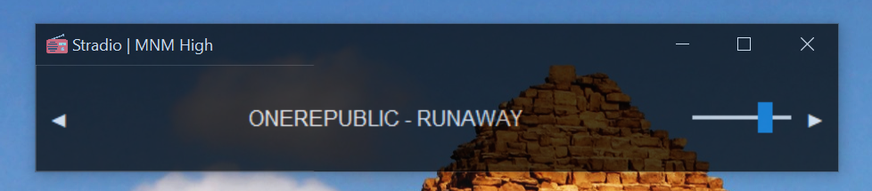

# Stradio

A laid-back python UI radio player for shuffling different online radio station streams.

## Setup
Make sure to have `Python >=3.11` installed
1. Install VLC 64 bit. And the following dependecies with pip
   1. python-vlc
   2. tkinter (if on windows)
   3. pillow
2. Clone the repository and open `main.py`, at the end add your streams i.e. radio stations.
3. Or import `radio` object 

Like this 

```python
from main.py import radio
streams = {
    'Naxi Love Radio': 'https://naxidigital-love128ssl.streaming.rs:8102/;stream.nsv',
    'MNM High': "http://icecast.vrtcdn.be/mnm-high.mp3",
    'BlueRock': 'http://prem1.rockradio.com:80/bluesrock?9555ae7caa92404c73cade1d'
}
radio(streams)
```

4. build to `.exe` with build.py

